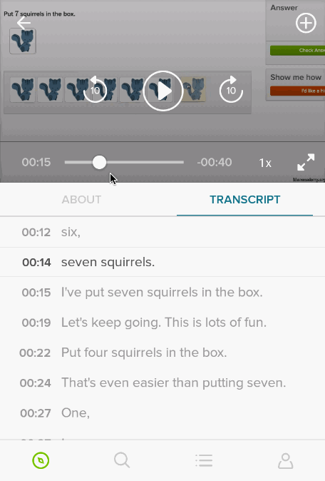

### Optimize your subscribers

Below are just a few ways to optimize your subscriptions to `Observable` instances.

#### Make the side-effect obvious

When defining a subscriber to an observable, attempt to move any filtering or transformations of the input to upstream operators. This makes any side-effect of the subscription more obvious.

For example, consider the following code from the video player of the [Khan Academy Android app](https://play.google.com/store/apps/details?id=org.khanacademy.android):

```java
getStateObservable().subscribe(state -> {
    switch (state) {
        case UNINITIALIZED:
        case PREPARING:
        case PAUSED:
        case ENDED:
        case ERROR:
            mVideoSurfaceHolder.setKeepScreenOn(false);
            return;

        case BUFFERING:
        case PLAYING:
            mVideoSurfaceHolder.setKeepScreenOn(true);
            return;
    }
    throw new IllegalArgumentException("Unknown player state: " + state);
});
```

The `getStateObservable()` method returns an `Observable` that emits the state of the video player. When that state is either the `BUFFERING` or `PLAYING` state, then we call the `setKeepSreenOn` method of `mVideoSurfaceHolder` with `true`. This keeps the screen turned on while the video is playing or is preparing to play. But when the video player is in any other state, then we call the `setKeepScreenOn` method with a value of `false` since playback is not and will not happen.

The side-effect is invoking `setKeepScreenOn`, but that constitutes only two lines of this 15 line method. Moreover, it requires close inspection to conclude that `setKeepScreenOn` is called for every state. Alternatively, we can rewrite this to use the `map` operator:

```java
getStateObservable()
        .map(state -> {
            switch (state) {
                case UNINITIALIZED:
                case PREPARING:
                case PAUSED:
                case ENDED:
                case ERROR:
                    return false;

                case BUFFERING:
                case PLAYING:
                    return true;
            }
            throw new IllegalArgumentException("Unknown player state: " + state);
        })
        .distinctUntilChanged()
        .subscribe(shouldKeepOnScreen -> {
            mVideoSurfaceHolder.setKeepScreenOn(shouldKeepOnScreen);
        });
```

The `map` operator returns whether the screen should be kept on for its state parameter. It is obvious that it returns a `boolean` value for every state, and consequently that `setKeepScreenOn` can be called for any state. And as the only line of the subscription body, the side-effect of invoking `setKeepScreenOn` is also obvious. Moreover, this allows us to precede creating the subscription with a call to `distinctUntilChanged`, which will ensure that we don't invoke the `setKeepScreenOn` method needlessly. (In practice, this is unlikely to matter; we only mean to show how creating thin subscribers can increase flexibility.)

#### Merge like subscribers

If you have multiple subscriptions to multiple `Observable` instances, and each of those subscriptions consumes the emitted values or notifications in the same manner, then use the `merge` static factory method to create a single `Observable` instance and subscribe to only that.

For example, in the [item for understanding `switchMap`](understand-switch-map.md), we created an `Observable<Long>` that emitted the video playback time at regular intervals as a video plays. When that observable emits a new time, we scroll to and highlight the part of the transcript that spans that time:

```java
mVideoPlayer.getPlayingTimeMillisObservable()
        .subscribe(playingTime -> {
            mTranscriptPlayer.highlightPartForTime(playingTime);
        });
```

Alternatively, the user can drag the "thumb" of the seek bar and seek through the video. As the user seeks through the video, we also scroll to and highlight the part of the video that spans the time that the user sought:



As the user seeks, the time sought is not emitted by the `Observable` from `getPlayingTimeMillisObservable`, because the video is not playing. Instead, as the user seeks, the `ExoPlayer` instance passes the sought time to the `seekTo` method of its registered `MediaPlayerControl`. We implement this method such that it emits on a `PublishSubject<Long>` named `mSeekingSubject`:

```java
@Override
public void seekTo(final int timeMillis) {
    mSeekingSubject.onNext(timeMillis);
}
```

The video player implementation exposes this subject as another `Observable<Long>`, available through a method named `getSeekingTimeMillisObservable`. Again, when that observable emits a new time, we scroll to and highlight the part of the transcript that spans that time:

```java
mVideoPlayer.getSeekingTimeMillisObservable()
        .subscribe(seekingTime -> {
            mTranscriptPlayer.highlightPartForTime(seekingTime);
        });
```

We consolidate these two subscribers using the `merge` method of `Observable`:

```java
Observable.merge(
        mVideoPlayer.getPlayingTimeMillisObservable(),
        mVideoPlayer.getSeekingTimeMillisObservable()
)
        .subscribe(highlightTime -> {
            mTranscriptPlayer.highlightPartForTime(highlightTime);
        });
```

Now it is far easier to intuit that as the video plays or as the user seeks through the video, we always highlight the part of the transcript that spans that time.

