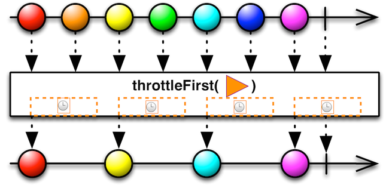

### Test work scheduling using `TestScheduler`

Operators like `debounce`, `delay`, `interval`, `repeat`, and `throttleFirst` accept a `Scheduler` parameter on which they schedule their work. If you are testing an `Observable` that uses one of these operators, have your test specify a `TestScheduler` instance as a parameter. This allows you to simulate the passing of time and execute work immediately. Do not, instead, add calls to `Thread.sleep` in your test so that it waits for the work to execute. Such calls make your tests brittle and extremely slow to run.

#### Using `TestScheduler`

Let us return to the example of [downloading a video for offline viewing](test-emitted-values-using-testobserver.md). In this case, there is an `Observable` that emits a `ByteStreamProgress` instance whenever a new sequence of bytes is received and written to the corresponding file. Such an instance specifies the number of bytes written so far and whether the file is now complete:

```java
@AutoValue
public abstract class ByteStreamProgress {
    public abstract long bytesWritten();
    public abstract boolean isComplete();

    public static ByteStreamProgress create(final long bytesWritten, final boolean isComplete) {
        checkArgument(bytesWritten >= 0, "Invalid bytesWritten: " + bytesWritten);

        return new AutoValue_ByteStreamProgress(bytesWritten, isComplete);
    }
}
```

Downstream, a series of `map` operators transform each `ByteStreamProgress` into a `DownloadEvent` for the corresponding file. But if the user has a fast Internet connection, dozens of `ByteStreamProgress` instances may be generated per second. If unchecked, this will create dozens of `DownloadEvent` instances per second, which will lead to updating the corresponding notification dozens of times per second.

To remedy this, we define a static factory method named `throttledObservable` on the `ByteStreamProgressUtils` class. On a given `Observable`, it uses `throttleFirst` to throttle the rate at which incomplete `ByteStreamProgress` instances are emitted. But it does not throttle the last `ByteStreamProgress` specifying that the file is complete. Using this throttled `Observable` will throttle the rate at which `DownloadEvent` instances are created and observed downstream:

```java
@VisibleForTesting
static Observable<ByteStreamProgress> throttledObservable(
        final Observable<ByteStreamProgress> observable,
        final long windowDuration,
        final TimeUnit timeUnit,
        final Scheduler scheduler) {
    final Observable<ByteStreamProgress> cachedObservable =
            observable.compose(ObservableUtils.cacheTransformer(1));
    return Observable.merge(
            cachedObservable
                    .filter(byteStreamProgress -> byteStreamProgress.isComplete()),
            cachedObservable
                    .filter(byteStreamProgress -> !byteStreamProgress.isComplete())
                    .throttleFirst(windowDuration, timeUnit, scheduler)
    );
}
```

Note that the marble diagram for `throttleFirst` is:



To test `throttledObservable`, we create a `PublishSubject` that will emit `ByteStreamProgress` instances without throttling, as well as a `TestScheduler` on which the throttling will occur. We pass both, along with a window duration, to method `throttledObservable`:

```java
final PublishSubject<ByteStreamProgress> progressSubject = PublishSubject.create();
final long windowDuration = 500;
final TestScheduler testScheduler = new TestScheduler();
final Observable<ByteStreamProgress> throttledObservable =
        ByteStreamProgressUtils.throttledObservable(
                progressSubject, windowDuration, TimeUnit.MILLISECONDS, testScheduler
        );
```

After we have created the throttled `Observable` instance, we first subscribe to it with a `TestObserver`. We then emit a sequence of `ByteSteamProgress` instances on `progressSubject`:

```java
// Emit incomplete progress with 10 and 20 bytes consumed in the first window.
testScheduler.advanceTimeTo(1, TimeUnit.MILLISECONDS);
progressSubject.onNext(ByteStreamProgress.create(10, false));
testScheduler.advanceTimeTo(2, TimeUnit.MILLISECONDS);
progressSubject.onNext(ByteStreamProgress.create(20, false));

// Emit incomplete progress with 30 and 40 bytes consumed in the second window.
testScheduler.advanceTimeTo(windowDuration + 1, TimeUnit.MILLISECONDS);
progressSubject.onNext(ByteStreamProgress.create(30, false));
testScheduler.advanceTimeTo(windowDuration + 2, TimeUnit.MILLISECONDS);
progressSubject.onNext(ByteStreamProgress.create(40, false));

// Emit complete progress with 50 bytes consumed in the second window.
testScheduler.advanceTimeTo(windowDuration + 3, TimeUnit.MILLISECONDS);
progressSubject.onNext(ByteStreamProgress.create(50, true));
```

We emit incomplete `ByteStreamProgress` instances with `10` and then `20` bytes in the first window. The `Observable` returned by `throttledObservable` should emit only the first instance in this pair. Similarly, we emit incomplete `ByteStreamProgress` instances with `30` and then `40` bytes in the second window. Again, `throttledObservable` should emit only the first instance in this pair.

Finally, we emit a complete `ByteStreamProgress` instance with `50` bytes in the second window. The `Observable` returned by `throttledObservable` should not throttling it, and consequently emit it.

To assert this behavior, we create the expected sequence of `ContentDownloadEvent` values and pass it to method `assertReceivedOnNext` of `TestObserver`:

```java
final List<ByteStreamProgress> expectedByteStreamProgress = ImmutableList.of(
        ByteStreamProgress.create(10, false),
        ByteStreamProgress.create(30, false),
        ByteStreamProgress.create(50, true)
);
testObserver.assertReceivedOnNext(expectedByteStreamProgress);
```

Note that the test above takes less than a millisecond to run on my computer, even though it simulates over 500 milliseconds passing. Use `TestScheduler` to keep your tests fast.

