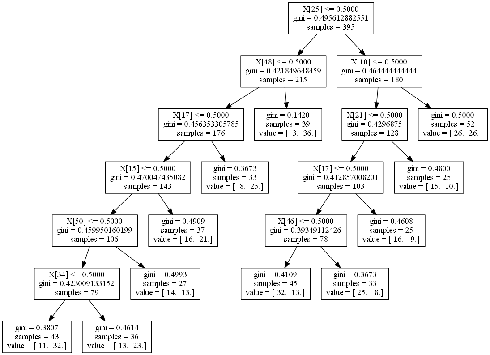
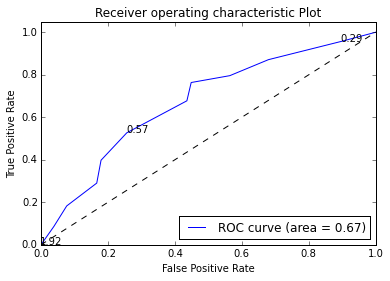

# Week 4 - "Judge, Jury, and Classifier" Lecture
# VIDEO 4
## Read in the data

    import os
    os.chdir('C:\\Users\\iris\\Downloads')
    import pandas as pd
    stevens = pd.read_csv("stevens.csv")
    def dfStr(df):
        print "The dataframe contains {0} rows and {1} columns".format(df.shape[0], df.shape[1])
        print "The data types of columns are: \n"
        print df.dtypes
    
    dfStr(stevens)

    The dataframe contains 566 rows and 9 columns
    The data types of columns are: 
    
    Docket        object
    Term           int64
    Circuit       object
    Issue         object
    Petitioner    object
    Respondent    object
    LowerCourt    object
    Unconst        int64
    Reverse        int64
    dtype: object
    

## CART Model
Proposed formula: `Reverse ~ Circuit + Issue + Petitioner + Respondent +
LowerCourt + Unconst`
Notice all predictors, except `Unconst` , are categorical data   **SO even
before splitting the dataset, we need to do some extra work**

    stevens.head()

<table border="1" class="dataframe">
  <thead>
    <tr style="text-align: right;">
      <th></th>
      <th>Docket</th>
      <th>Term</th>
      <th>Circuit</th>
      <th>Issue</th>
      <th>Petitioner</th>
      <th>Respondent</th>
      <th>LowerCourt</th>
      <th>Unconst</th>
      <th>Reverse</th>
    </tr>
  </thead>
  <tbody>
    <tr>
      <th>0</th>
      <td> 93-1408</td>
      <td> 1994</td>
      <td> 2nd</td>
      <td> EconomicActivity</td>
      <td> BUSINESS</td>
      <td> BUSINESS</td>
      <td> liberal</td>
      <td> 0</td>
      <td> 1</td>
    </tr>
    <tr>
      <th>1</th>
      <td> 93-1577</td>
      <td> 1994</td>
      <td> 9th</td>
      <td> EconomicActivity</td>
      <td> BUSINESS</td>
      <td> BUSINESS</td>
      <td> liberal</td>
      <td> 0</td>
      <td> 1</td>
    </tr>
    <tr>
      <th>2</th>
      <td> 93-1612</td>
      <td> 1994</td>
      <td> 5th</td>
      <td> EconomicActivity</td>
      <td> BUSINESS</td>
      <td> BUSINESS</td>
      <td> liberal</td>
      <td> 0</td>
      <td> 1</td>
    </tr>
    <tr>
      <th>3</th>
      <td>  94-623</td>
      <td> 1994</td>
      <td> 1st</td>
      <td> EconomicActivity</td>
      <td> BUSINESS</td>
      <td> BUSINESS</td>
      <td>  conser</td>
      <td> 0</td>
      <td> 1</td>
    </tr>
    <tr>
      <th>4</th>
      <td> 94-1175</td>
      <td> 1995</td>
      <td> 7th</td>
      <td>    JudicialPower</td>
      <td> BUSINESS</td>
      <td> BUSINESS</td>
      <td>  conser</td>
      <td> 0</td>
      <td> 1</td>
    </tr>
  </tbody>
</table>

# Extra work for Python
Encoding categorical predictors using one-hot encoding
**First** : Create a dictionary with the categorical data points for each row

    catColumns = ['Circuit', 'Issue' ,'Petitioner','Respondent','LowerCourt']
    catDict = stevens[catColumns].to_dict(outtype='records')
    catDict[:2]

    [{'Circuit': '2nd',
      'Issue': 'EconomicActivity',
      'LowerCourt': 'liberal',
      'Petitioner': 'BUSINESS',
      'Respondent': 'BUSINESS'},
     {'Circuit': '9th',
      'Issue': 'EconomicActivity',
      'LowerCourt': 'liberal',
      'Petitioner': 'BUSINESS',
      'Respondent': 'BUSINESS'}]

**Second**: Transform our dictionary to a binary on-hot encoded array for each
row

    from sklearn import feature_extraction
    vec = feature_extraction.DictVectorizer()
    catVector = vec.fit_transform(catDict).toarray()
    catVector[:2]

    array([[ 0.,  0.,  0.,  1.,  0.,  0.,  0.,  0.,  0.,  0.,  0.,  0.,  0.,
             0.,  0.,  0.,  0.,  1.,  0.,  0.,  0.,  0.,  0.,  0.,  0.,  1.,
             0.,  1.,  0.,  0.,  0.,  0.,  0.,  0.,  0.,  0.,  0.,  0.,  0.,
             1.,  0.,  0.,  0.,  0.,  0.,  0.,  0.,  0.,  0.,  0.],
           [ 0.,  0.,  0.,  0.,  0.,  0.,  0.,  0.,  0.,  0.,  1.,  0.,  0.,
             0.,  0.,  0.,  0.,  1.,  0.,  0.,  0.,  0.,  0.,  0.,  0.,  1.,
             0.,  1.,  0.,  0.,  0.,  0.,  0.,  0.,  0.,  0.,  0.,  0.,  0.,
             1.,  0.,  0.,  0.,  0.,  0.,  0.,  0.,  0.,  0.,  0.]])

**Third**: Construct a separate dataframe with the one-hot encoded data and name
the columns

    dfVector = pd.DataFrame(catVector)
    vectorColumns = vec.get_feature_names()
    vectorColumns[:5]

    ['Circuit=10th', 'Circuit=11th', 'Circuit=1st', 'Circuit=2nd', 'Circuit=3rd']

Finally: Construct the transformed dataset

    stevensT = dfVector.copy()
    stevensT.columns = vectorColumns
    stevensT.index = stevens.index
    stevensT[['Unconst','Reverse']] = stevens[['Unconst','Reverse']]

## Split the data

    from sklearn.cross_validation import train_test_split
    train0, test0 = train_test_split(stevensT.loc[stevensT['Reverse']==0,:], train_size=0.7, random_state=3000)
    train1, test1 = train_test_split(stevensT.loc[stevensT['Reverse']==1,:], train_size=0.7, random_state=3000)
    Train = pd.DataFrame(np.vstack((train0,train1)), columns=stevensT.columns).convert_objects(convert_numeric=True)
    Test = pd.DataFrame(np.vstack((test0,test1)), columns=stevensT.columns).convert_objects(convert_numeric=True)

## CART model
The tree algorithm implemented by `sci-kit learn` is CART.
Set the minimal number of data points in each node to be 25

    from sklearn import tree
    StevensTree = tree.DecisionTreeClassifier(min_samples_leaf=25)
    predictors = Train.columns.tolist()
    predictors.remove('Reverse')
    X = Train[predictors]
    y = Train.Reverse
    StevensTree.fit(X,y)

    DecisionTreeClassifier(compute_importances=None, criterion='gini',
                max_depth=None, max_features=None, max_leaf_nodes=None,
                min_density=None, min_samples_leaf=25, min_samples_split=2,
                random_state=None, splitter='best')

Plot the tree.
For this part, you need to install `graphviz` on your machine and the path
variable is added.

    from sklearn.externals.six import StringIO  
    import pydot 
    dot_data = StringIO() 
    tree.export_graphviz(StevensTree, out_file=dot_data) 
    graph = pydot.graph_from_dot_data(dot_data.getvalue()) 
    graph.write_png("stevensTree.png") 

    True

Look at the tree

    from IPython.display import Image
    i = Image(filename='stevensTree.png')
    i

## Make predictions

    XTest = Test[predictors]
    yTest = Test.Reverse
    PredictCART = StevensTree.predict(XTest)
    from sklearn.metrics import confusion_matrix
    print confusion_matrix(yTest, PredictCART)

    [[58 20]
     [44 49]]
    

    (49+58)/(58+49+20+44.0)

    0.6257309941520468

## ROC curve
We need real valued prediction output to get ROC curve.

    PredictCARTR = StevensTree.predict_proba(XTest)[:,1]
    from sklearn.metrics import roc_curve, auc
    fpr, tpr, thresholds = roc_curve(yTest, PredictCARTR)
    roc_auc = auc(fpr, tpr)
    import matplotlib.pyplot as plt
    plt.figure()
    plt.plot(fpr, tpr, label='ROC curve (area = %0.2f)' % roc_auc)
    plt.plot([0, 1], [0, 1], 'k--')
    for i in range(len(fpr)):
        if i%5 == 0:
            plt.text(fpr[i],tpr[i],str(round(thresholds[i],2)))
    plt.xlim([0.0, 1.0])
    plt.ylim([0.0, 1.05])
    plt.xlabel('False Positive Rate')
    plt.ylabel('True Positive Rate')
    plt.title('Receiver operating characteristic Plot')
    plt.legend(loc="lower right")
    plt.show()

    from sklearn.ensemble import RandomForestClassifier
    StevensForest = RandomForestClassifier(n_estimators = 200, min_samples_leaf = 25)
    StevensForest.fit(X,y)

    RandomForestClassifier(bootstrap=True, compute_importances=None,
                criterion='gini', max_depth=None, max_features='auto',
                max_leaf_nodes=None, min_density=None, min_samples_leaf=25,
                min_samples_split=2, n_estimators=200, n_jobs=1,
                oob_score=False, random_state=None, verbose=0)

## Make predictions

    PredictForest = StevensForest.predict(XTest)
    print confusion_matrix(yTest, PredictForest)

    [[57 21]
     [36 57]]
    

    (57+57)/(57+57+21+36.0)

    0.6666666666666666

# VIDEO 6
There is no complexitity parameter `cp` for CART model in `scikit-learn`.
We got the `min_sample_leaf = 25` from the lecturer, are there other options
beside that?
I will use `Cross Validation` to choose a `min_samples_leaf` to train model.

    from sklearn.cross_validation import StratifiedKFold
    folds = StratifiedKFold(Train['Reverse'], n_folds=10)
    values = range(1,100)
    avgScores = []
    for s in values:
        scores = []
        for train, test in folds:
            model = StevensTreeReg = tree.DecisionTreeClassifier(min_samples_leaf = s)
            model.fit(Train.loc[train,predictors], Train.loc[train, 'Reverse'])
            pred = model.predict(Train.loc[test,predictors])
            cm = confusion_matrix(Train.loc[test,'Reverse'], pred)
            scores.append((cm[0,0]+ cm[1,1])/float(sum(cm)))
        avgScores.append(mean(scores))
    s = values[avgScores.index(max(avgScores))]
    print s

    49
    

Got a different value

    StevensTreeCV = tree.DecisionTreeClassifier(min_samples_leaf = s)
    StevensTreeCV.fit(X, y)
    PredictCV = StevensTreeCV.predict(XTest)
    print confusion_matrix(yTest, PredictCV)

    [[57 21]
     [36 57]]
    

    (57+57)/(57+21+36+57.0)

    0.6666666666666666

