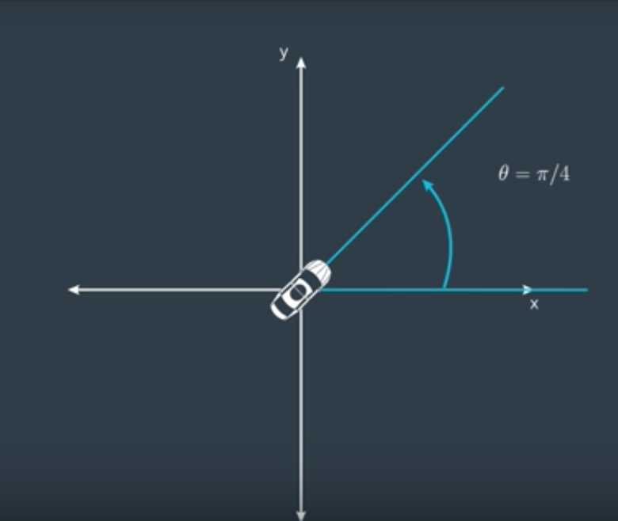
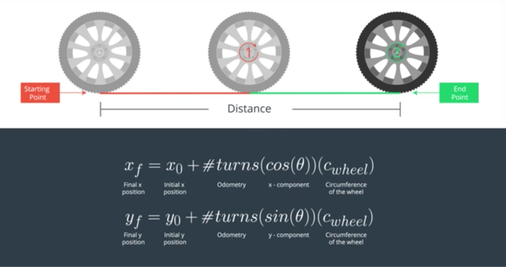

# Motion Models

## Bicycle motion model: from a car to a bicycle

- Ignore verticle dynamics of the model.
- Assume front wheels like one wheel, likewise with back wheels.
- Assume car controlled like a bicycle.

### Yaw rate equations

Yaw: Rotation of the car about the z-axis.

### Frames of reference: a comparison (Localisation vs Sensor Fusion)

- Coordinates: L uses vehicle or map coordinates, S uses only vehicle coordinates.
- Position of car described in: L: map. S: car always assumed to be at origin of the vehicle coord system.
- Sensor measurements in: L, S (both) vehicle coords.
- Map: L: Map landmarks in map coordinates. S: No map.

### Roll, Pitch and Yaw

- Roll: Rotation of the car about the x-axis.
- Pitch: Rotation of the car about the y-axis.
  - Important in hilly places.

### Odometry: Motion sensor data

- Commonly from wheel sensors (number of wheel rotations -> distance travelled)
- Errors on
  - wet (slipping wheels travel less than expected + slide when braking) roads or
  - bumpy roads (overestimates distance since car moves up and down vs assumed it doesn't move vertically).

