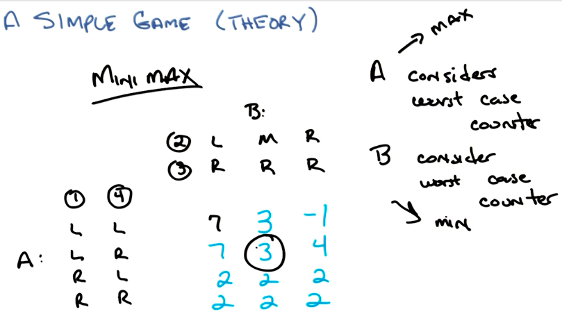
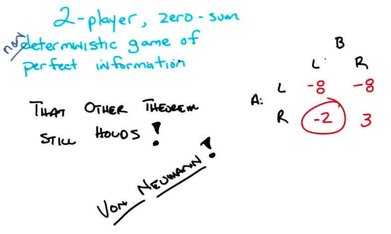

# Game Theory

## What is Game Theory?

## Simple game

Given the simple game below:

### Minimax

The game-matrix can be calculated as:

And the result of minimax for this game is `3`, because of the Fundamental Result Theorem.

### Fundamental Result Theorem

## Non-deterministic Game

### Von Neumann Theorem

The "Other Theorem" is the Fundamental Result Theorem.

## Hidden information Game

### Mixed Strategy

### Mini poker result

## Prisioner's Dilemma (Non Zero Sum Game)

## Nash Equilibrium

### Nash Equilibrium Example

### Nash Equilibrium Implications

## Summary

Additional References:
- [Andrew Moore's slides on Zero-Sum Games](http://www.autonlab.org/tutorials/gametheory.html)
- [Andrew Moore's slides on Non-Zero-Sum Games](http://www.autonlab.org/tutorials/nonzerosum.html)

[UPDATE_FROM: https://github.com/ritchieng/machine-learning-nanodegree/tree/master/reinforcement_learning/game_theory]
