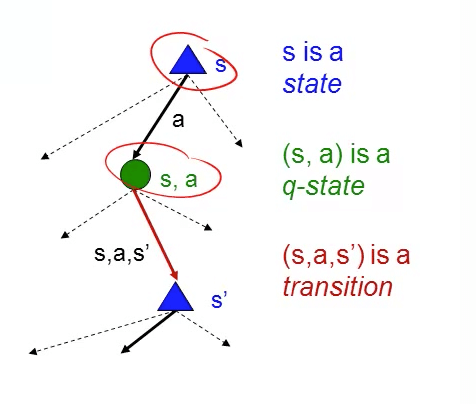
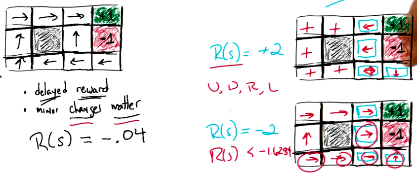
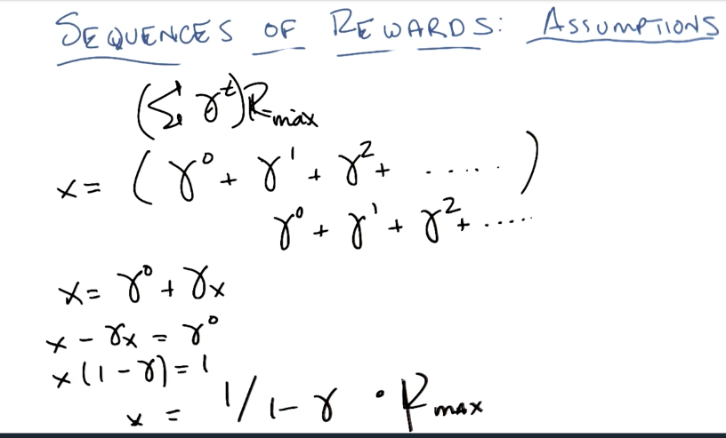
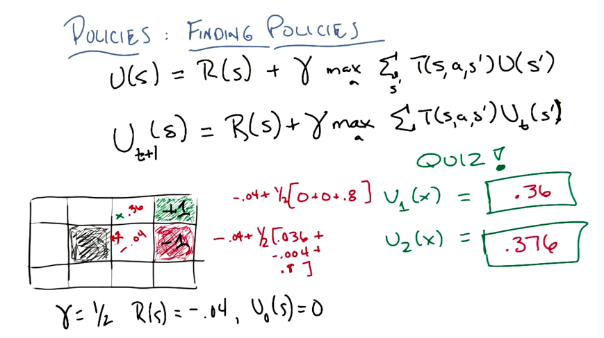
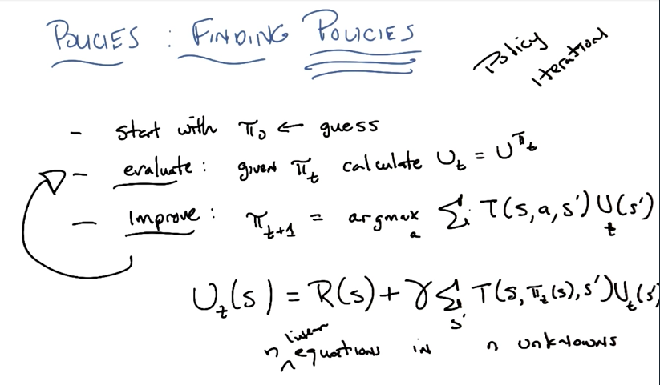
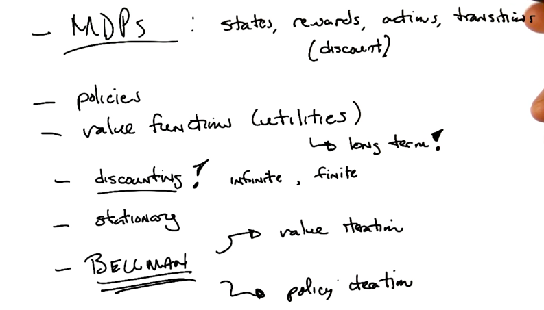

# Markov Decision Process

## Comparison of Learning Types

**Differences in Learning**

- Supervised learning: y = f(x)
  - Given x-y pairs
  - Learn function f(x)
    - Function approximation
- Unsupervised learning: f(x)
  - Given x's
  - Learn the function f(x)
    - Clustering description
- Reinforcement learning:
  - Given x's and z's
  - Learn function f(x)

In *Supervised Learning*, we are given `y` and `x` and we try to find the best function `f` that fits `f(x) = y`.

In *Unsupervised Learning*, we are given `x` and we try to find the best function `f` that produces a compact description of `x` in the form of `f(x)` clusters.

In *Reinforcement Learning*, we are given `x` and `z` and we try to find `f` and `y`, where `f(x) = y`. It looks a lot like supervised learning, but the main difference is that we are not given the labels (`y`), but instead the reinforcers and punishers (`z`) to adjust the function `f`.

## Markov Decision Process Explained

### Markov Assumptions
- Stationary. Actions, states and the model can't change. The agent is the only element of change on the model.
- Only present matters. The transition function should only evaluate the current state to determine the probability of the outcome.

### Image Explained

- **States: `S`** - represents all the possible states that the agent may be in. They are kind of like positions on a map if you are navigating to an end point.
- **Model: `T(s, a, s') -> Pr(s' | s, a)`** - represents the transition function, which outputs the probability of the agent reaching state `s'` by taking action `a`, given that it is in state `s`.
    - s: state
    - a: action
    - s': another state
    - Probability of s' given s and a
        - Simple: if you're in a deterministic world, if you go straight (a) from the toilet (s), you would go straight (s') with a probability of 1.
        - Slightly complex: can be that you have a probability of only 0.8 if you choose to go up, you may go right with a probability of 0.2.
    - Your potential state (s') is only dependent on your current state (s) if not you will have more s-es.
        - This is a Markovian property where only the present matters.
        - Also, given the present state, the future and the past are independent.
- Actions: `A(s) or A` - represents all possible actions for each state. Actions are usually constant for all states, so they are represented by `A`.
    - They are things you can do such as going up, down, left and right if you are navigating through a box grid.
    - They can be other kinds of actions too, depending on your scenario.
- Reward  - represents the agent's reward
    - Scalar value for being in a state.
        - Position 1, you'll have 100 points.
        - Position 2, you'll have -10 points.
    - `R(s)`: being on state `s``
    - ``R(s,a)`: being on state `s` and taking action `a`
    - R(s,a,s')`:  being on state `s`, taking action `a` and achieving state `s'`.`
    -  `All these representations provide the same mathematical value and can be modeled by `R(s)` alone.
- Policy - represents the "master plan" to solve the problem. It is represented by a mapping of states to actions `π(s) -> a`, where for any given state `s` it outputs the best course of action `a` to take.
    - `π*` represents the optimal solution - the mapping that maximizes the rewards.
    - - This is basically the solution: what action to take in any particular state.
      - It takes in a state, s, and it tells you the action, a, to take.
      - π* optimizes the amount the reward at any given point in time.
        - Here we have (s, a, r) triplets.
          - We need to find the optimal action
          - Given what we know above
            - π*: function f(x)
            - r: z
            - s: x
            - a: y
    - Visualization
      

## More on rewards

Some examples of Policies affected by different rewards:

- **Delayed rewards**You won't know what your immediate action would lead to down the road.Example in chessYou did many movesThen you have your final reward where you did well or badlyYou could have done well at the start then worst at the end.You could have done badly at the start then better at the end.
- **Example**
  R(s) = -0.01
  - Reward for every state except for the 2 absorbing states is -0.01.
  - s_good = +1
  - s_bad = -0.01
  - Each action you take, you get punished.You are encouraged to end the game soon.
  - Minor changes to your reward function matters a lot.If you have a huge negative reward, you will be in a hurry.If you have a small negative reward, you may not be in a hurry to reach the end.

## Sequence of Rewards: Assumptions

**Stationary preferences**

[a1, a2, ...] > [b1, b2, ...][r, a1, a2, ...] > [r, b1, b2, ...]

You'll do the same action regardless of time.

### Infinite Horizons

*Infinite Horizons* means we can take as many steps as we want through the MDP.

- The game does not end until we reach the absorbing state.
  - If we do not have an inifinite time, and a short amount of time, we may want to rush through to get a positive reward.
    - **Policy with finite horizon: π(s, t) → a**This would terminate after tGives non-stationary polices where states' utilities changes with time.

### Utility of Sequences

*Utility of Sequences* measures the total reward value of a given sequence of steps.

- We will be adding rewards using discounted sums.
  - 
  - If we do not multiply by gamma, all the rewards would sum to infinity.
  - When we multiply by gamma, we get a geometric series that allows us to multiply an infinite number of rewards to get a finite number.
  - Also, the discount factor is multiplied because sooner rewards probably have higher utility than later rewards.
    - Things in the future are discounted so much they become negligible. Hence, we reach a finite number for our utility.

#### Sum of each step reward

)

The sum of all rewards for each step is not a good measure of utility because, assuming we are working with infinite horizons, we will have infinite and all sequences will always provide infinite utility, as shown below.

**Absorbing state**

Guarantee that for every policy, a terminal state will eventually be reached.

#### Discounted Rewards

)

Discounted rewards is a geometric sequence that provides a finite number to measure the utility against sequences.

Maximization of discounted rewards:

which is demonstrated by:

## Bellman Equation

### Algorithmic Solution

### Example (Quiz)

### Finding the Policies

While the solutions presented above find the true Utility Values for each state, we are not interested in finding these values, but instead we are interested in finding the Optimal Policy.

The image below shows a simplification of the solutions elaborated previously to solve this.

**Finding Policies: Value Iteration**

1. We start with arbitrary utilities
   - For example, 0.
2. Update utilities based on neighbours (all the states it can reach).
   - 
   - Bellman update equation.
3. Repeat until convergence

**Finding Policies: Policy Iteration**

1. Start with by guessing
   - 
2. Evaluate
   - Given
     - 
   - Calculate
     - 
3. Improve: maximizing expected utility
   - 
   - 

## Summary

**Further Readings**

- [https://www.youtube.com/watch?v=W1S-HSakPTM&list=PL6MuV0DF6AuoviA41dtji6q-PM4hvAcNk&index=14](https://www.youtube.com/watch?v=W1S-HSakPTM&list=PL6MuV0DF6AuoviA41dtji6q-PM4hvAcNk&index=14)
- [http://mnemstudio.org/path-finding-q-learning-tutorial.htm](http://mnemstudio.org/path-finding-q-learning-tutorial.htm)

Credit

 https://github.com/ritchieng/machine-learning-nanodegree/blob/master/reinforcement_learning/markov_decision_processes/mdp.ipynb]