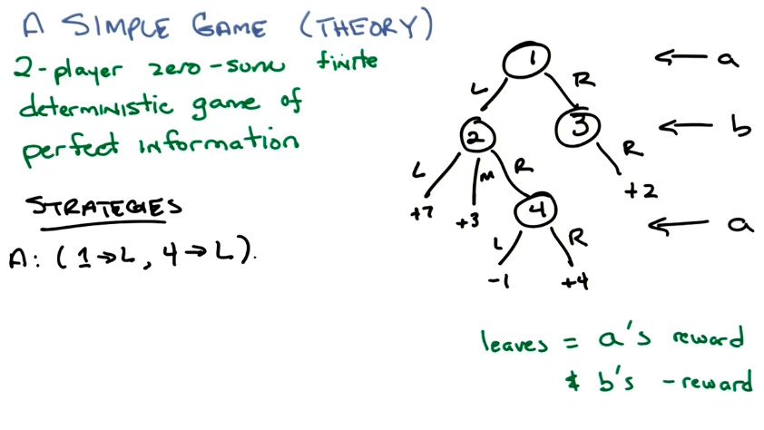
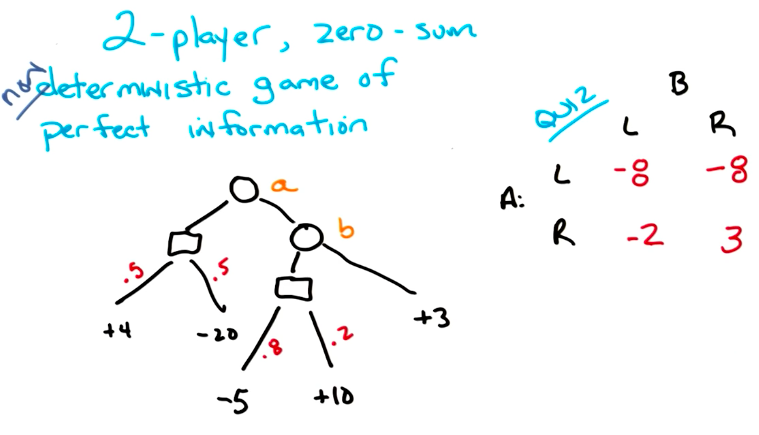
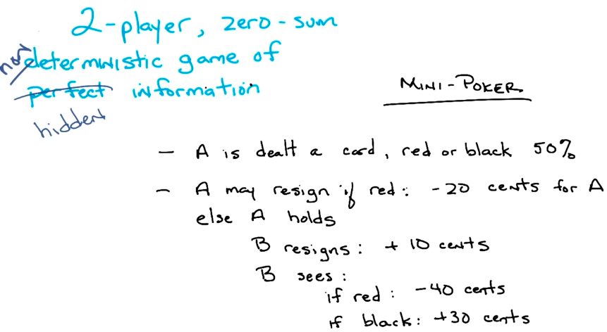
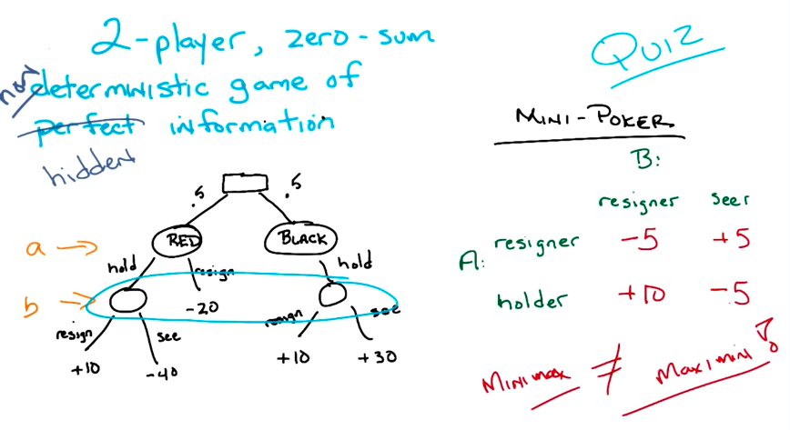
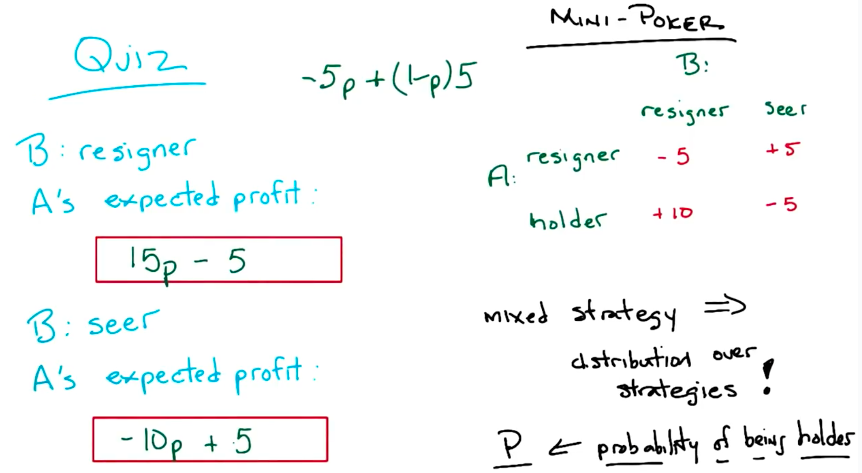
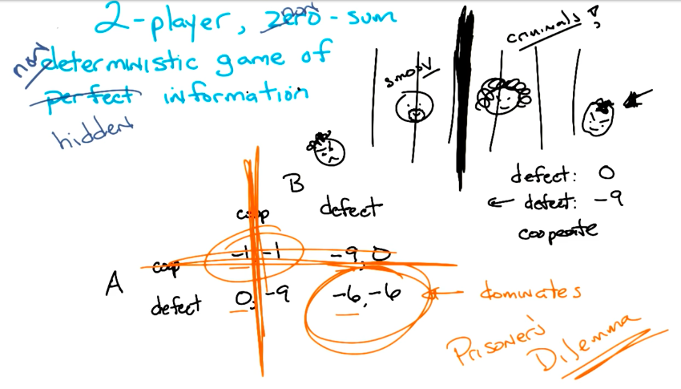
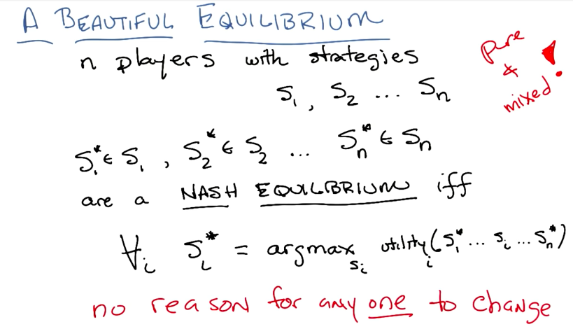
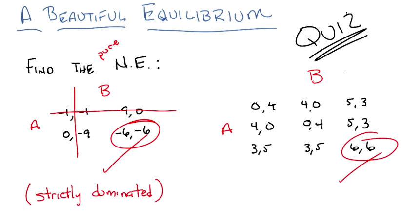
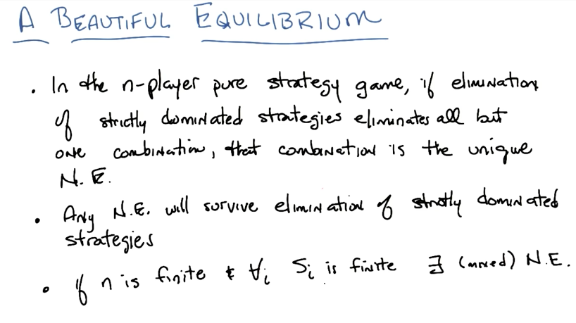
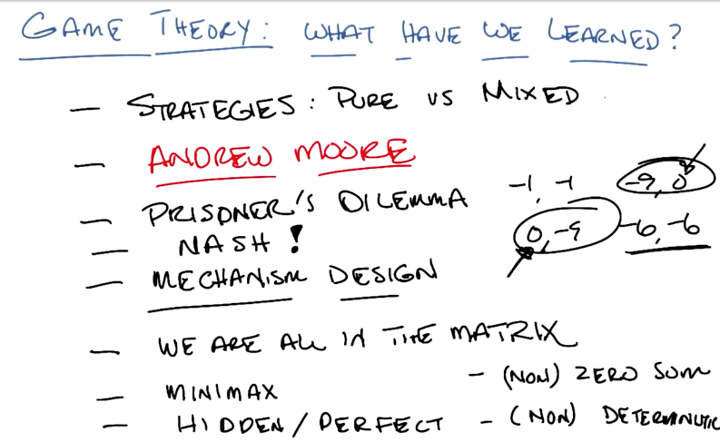

# Game Theory

## What is Game Theory?

- Mathematics of conflict.
- Multiple agents.
- Used in economics.
- Increasingly a part of AI/ML.

## Simple game

Given the simple game below:

**1. Two-player zero-sum finite deterministic game of perfect information**

### Minimax

The game-matrix can be calculated as:

- - A's points: leaves.
  - B's points: negative of A.
    - Pure strategy: 2
      - A: maximize
      - B: minimize

**Minimax  Maximax Strategy**

- Both A and B would consider the worst case counter strategy.
  - A: maximize points.
  - B: minimize points.
- There would always have an optimal pure strategy for each player.
  - You are assuming they are doing the same thing.
  - You are also assuming they are assuming everyone else are doing the same thing

And the result of minimax for this game is `3`, because of the Fundamental Result Theorem.

### Fundamental Result Theorem

**2. Two-player zero-sum finite non-deterministic game of perfect information**

## Non-deterministic Game

Pure Strategy: -2A would maximizeB would minimize

### Von Neumann Theorem

The "Other Theorem" is the Fundamental Result Theorem.

## Hidden information Game

Mini-poker

- A is dealt a card, red or black with a probability of 50% each
  - Red is bad for A
  - Black is good for A
- A may resign if given a red card: - 20 for A
  - Else A can hold:
    - B resigns: + 10
    - B sees:
      - If red: - 40
      - If black: + 30

### Mixed Strategy

### Mini poker result

- Minimax is not equal to Maximax in this scenario.
  - A's strategy depends on what B would do.
  - B's strategy depends on what A would do.
  - We can use a **mixed strategy** here.There's a distribution over strategies.

- Assume p is the probability of being a "holder" and A has a mixed strategy.

  - B: resigner

    - A's expected profit:
      - 10p + (1-p)(-5) = 15p - 5

  - B: seer

    - A's expected profit:
      - -5p + (1-p)(5) = -10p + 5

  - - **We equate the equations to find out that we have p=0.4, where the expected value of game is +1.**

## Prisioner's Dilemma (Non Zero Sum Game)

## Nash Equilibrium

### Nash Equilibrium Example

### Nash Equilibrium Implications

- n players with strategies 
-  are in **Nash Equilibrium** if there is no reason for anyone to change.

**Nash Equilibrium Notes**

- In the n-player pure strategy game, if elimination of strictly dominated strategies elimates all but one combination, that combination is the unique NE.
- Any NE will survive elimination of strictly dominated strategies.
- If n is finite and for all strategies which are finite, then there exist at least one NE.
- If you have n-repeated game, you have n-repeated NE.

## Summary

Additional References:
- [Andrew Moore's slides on Zero-Sum Games](http://www.autonlab.org/tutorials/gametheory.html)
- [Andrew Moore's slides on Non-Zero-Sum Games](http://www.autonlab.org/tutorials/nonzerosum.html)

[UPDATE_FROM: https://github.com/ritchieng/machine-learning-nanodegree/tree/master/reinforcement_learning/game_theory]
